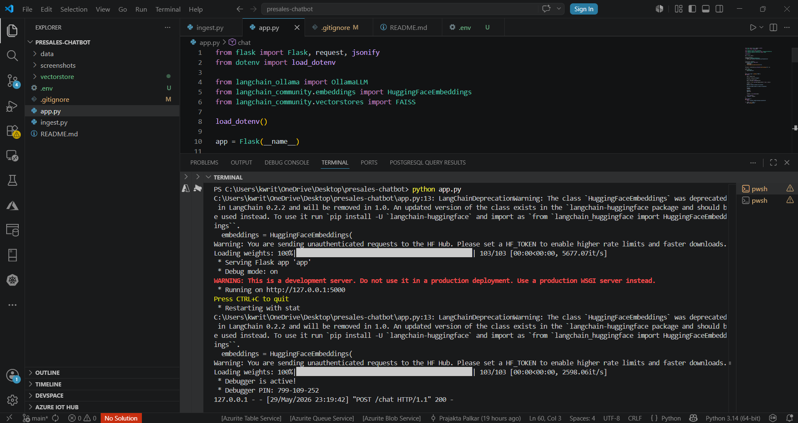
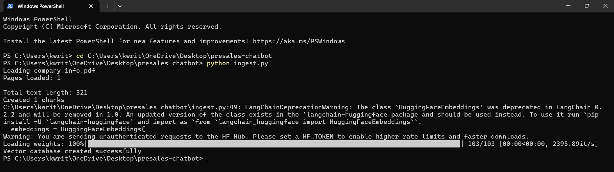
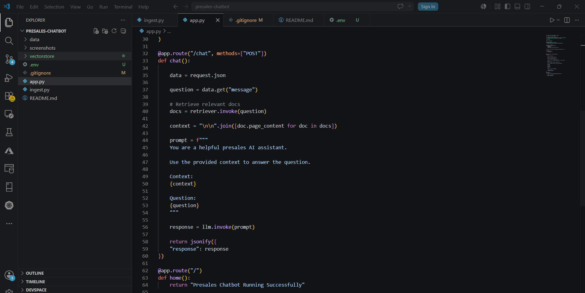
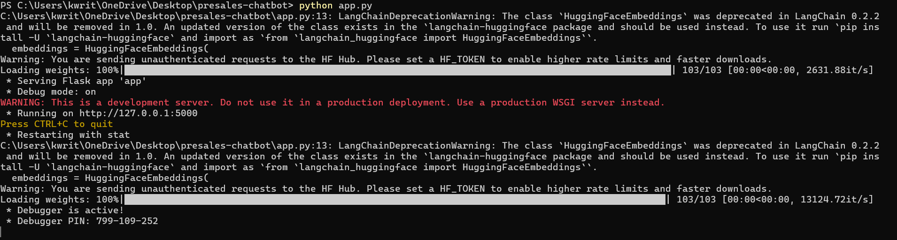
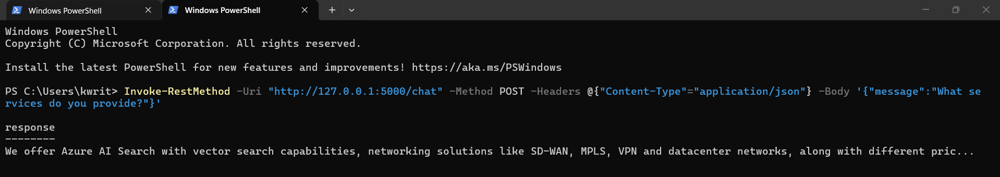

# AI Presales Chatbot (RAG-Based)

A Retrieval-Augmented Generation (RAG) chatbot built using:

* Flask
* LangChain
* FAISS Vector Database
* HuggingFace Embeddings
* Ollama
* Phi-3 Mini Local LLM

---

# Architecture

This solution follows a Retrieval-Augmented Generation (RAG) architecture.


---

# Project Structure



The chatbot consists of:

* PDF document ingestion
* Text chunking
* Vector embeddings
* FAISS vector database
* Local LLM inference
* Flask REST API

---

# Vector Database Creation



Documents are converted into embeddings and stored in a FAISS vector database for semantic search.

---

# Flask API Implementation



The API exposes a `/chat` endpoint that:

1. Accepts a user query
2. Retrieves relevant document chunks
3. Sends context to the LLM
4. Returns the generated response

---

# Flask Server Running



The chatbot runs locally using Flask.

---

# Chatbot Response



Example query:

"What services do you provide?"

The chatbot retrieves relevant information from the knowledge base and generates a response.

---

# Features

* Retrieval-Augmented Generation (RAG)
* Semantic document search
* Local vector database using FAISS
* Local LLM inference using Ollama
* REST API endpoint
* No paid APIs required

---

# Tech Stack

* Python
* Flask
* LangChain
* FAISS
* HuggingFace Sentence Transformers
* Ollama
* Phi-3 Mini

---

# Installation

Clone repository:

```bash
git clone <repository-url>
cd presales-chatbot
```

Install dependencies:

```bash
pip install -r requirements.txt
```

Install Ollama:

https://ollama.com/download/windows

Run model:

```bash
ollama run phi3:mini
```

---

# Create Vector Database

Place PDF files inside:

```text
data/
```

Run:

```bash
python ingest.py
```

---

# Run Chatbot

```bash
python app.py
```

Application runs at:

```text
http://127.0.0.1:5000
```

---

# Test API

```powershell
Invoke-RestMethod -Uri "http://127.0.0.1:5000/chat" -Method POST -Headers @{"Content-Type"="application/json"} -Body '{"message":"What services do you provide?"}'
```

---

# Example Use Cases

* Presales Support Assistant
* Internal Knowledge Base Chatbot
* Networking Documentation Assistant
* Product Information Retrieval
* Local RAG System

---

# Future Enhancements

* Web UI
* Streamlit Frontend
* User Authentication
* Chat History
* Docker Deployment
* Multi-document Upload Support

---

# Author

Prajakta Palkar
